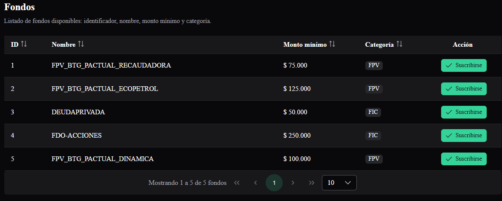
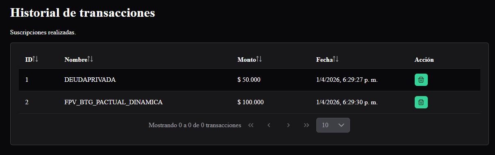

# 📊 Fondos App


Aplicación Angular para la gestión de fondos, con suscripción y desuscripción de fondos, historial de transacciones y visualización de saldo disponible.  

---

## 🚀 Características principales
- Listado de fondos disponibles con nombre, categoría y monto mínimo.
- Suscripción y desuscripción a fondos con actualización automática del saldo.
- Historial de transacciones con ID, nombre, monto y fecha.
- Notificaciones de éxito y alerta mediante **PrimeNG Toast**.
- Interfaz moderna con **PrimeNG** y **PrimeIcons**.

---

## 📸 Capturas de pantalla



## ⚙️ Instalación

Clona el repositorio y ejecuta:

```bash
git clone https://github.com/usuario/fondos-app.git
cd fondos-app
npm install
```

## 🖥️ Ejecución
Modo desarrollo:

```bash
ng serve
```
## 🛠️ Tecnologías utilizadas

Angular 21
PrimeNG
PrimeIcons
